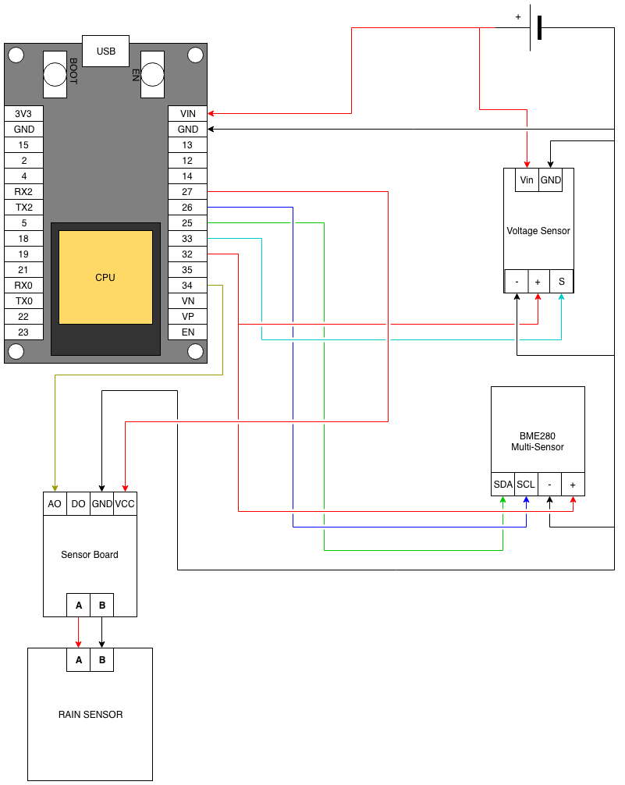
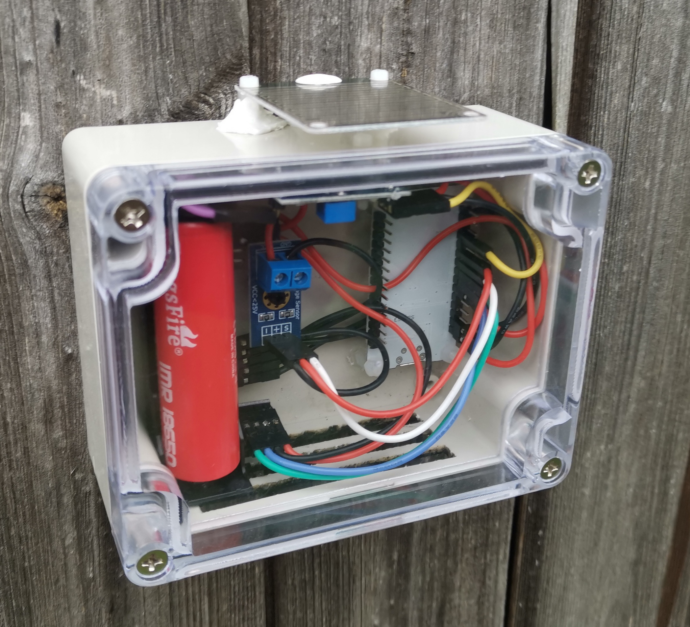

# Environment Monitor with Logging to InfluxDB (TICK stack)

This device measures environmental conditions such as temperature,  humidity, relative pressure and rainfall and reports that data to InfluxDB via the Telegraf endpoint when deployed as part of the TICK  stack (https://www.influxdata.com/time-series-platform/).  It also  includes a battery voltage monitor to enable alerting when the device  needs to be recharged.  The current timestamp is retrieved via NTP each time the board wakes from deep sleep mode.

## TICK stack deployment

I used a modified version of the Docker Compose script found [here](https://medium.com/lucjuggery/the-tick-stack-as-a-docker-application-package-1d0d6b869211) that adds persistent volumes for storage and configuration of Chronograf dashboards and Kapacitor alerting as well as exposing additional endpoints such as InfluxDB itself.  The YAML for this deployment can be found in the tick-stack directory.  I deployed this onto an ESXi box I had with spare capacity and added a DNS entry with fixed IP using my LAN's [pi-hole](https://pi-hole.net/) DHCP/DNS server.

## Components Required

Please note that all links are via Amazon UK.  This is solely because that's where I purchased them.  I did not receive any consideration from Amazon for linking to their site.  While these are the specific components that I used, there are many similar pin-compatible items available as alternatives.
* [JZK ESP32 DevKit clone](https://www.amazon.co.uk/gp/product/B071JR9WS9/ref=ppx_yo_dt_b_asin_title_o03_s01?ie=UTF8&psc=1).  Any DevKitC variant will do but this was the cheapest I could find in the UK
* [Voltage Detector](https://www.amazon.co.uk/gp/product/B076Q27P59/ref=ppx_yo_dt_b_asin_title_o09_s00?ie=UTF8&psc=1)
* [Rain Sensor](https://www.amazon.co.uk/gp/product/B072JCRY6R/ref=ppx_yo_dt_b_asin_title_o05_s00?ie=UTF8&psc=1)
* [BME280-based Multi-Sensor](https://www.amazon.co.uk/gp/product/B0799FH5PG/ref=ppx_yo_dt_b_asin_title_o06_s00?ie=UTF8&psc=1)
* [18650 battery holder](https://www.amazon.co.uk/gp/product/B075TZF7NN/ref=ppx_yo_dt_b_search_asin_title?ie=UTF8&psc=1)
* [18650 battery](https://www.amazon.co.uk/Samsung-2500mah-Batteries-18650INR-Rechargeable/dp/B07M7PBSC2/ref=sr_1_5?keywords=samsung+18650&qid=1558945995&s=gateway&sr=8-5).  The product page for the version I ordered is no longer active and there are a lot of reports of fakes in reviews I've see so caveat emptor.  Having a decent charger such as a Nightcore D4 is also a good idea.
* DuPont wires (female to female) and header pins.  The wires can be purchased ready-made but I prefer to crimp my own to both control the length of the cables and to use more flexible wire.  I used [this wire](https://www.amazon.co.uk/gp/product/B01M0O1NXM/ref=ppx_yo_dt_b_search_asin_title?ie=UTF8&psc=1) with [this connector kit](https://www.amazon.co.uk/gp/product/B078K9DT69/ref=ppx_yo_dt_b_search_asin_title?ie=UTF8&psc=1) though the 22 gauge wire can be fiddly to get into the DuPont connectors.
* Project box.  For indoor sensors I used [this small box](https://www.amazon.co.uk/gp/product/B01GDN5NHC/ref=ppx_yo_dt_b_search_asin_title?ie=UTF8&psc=1) and for outdoors I used [this larger one](https://www.amazon.co.uk/gp/product/B0725ZQGVP/ref=ppx_yo_dt_b_search_asin_title?ie=UTF8&psc=1).  For outdoors I would highly recommend using a [Stevenson Screen](https://en.wikipedia.org/wiki/Stevenson_screen) instead unless you have somewhere that's always in shade otherwise you will get extremely high temperature readings in direct sunlight.  They are very expensive to buy but there are a number of guides on building your own.  In order to add some ventilation to the outdoor box I cut a grille in the bottom using a laser cutter though it was a time-consuming process to get through the ABS without melting it too much.
* [Nylon Standoffs](https://www.amazon.co.uk/gp/product/B06XFV5629/ref=ppx_yo_dt_b_search_asin_title?ie=UTF8&psc=1) to attach the board and sensors to the case
* A drill (I use a dremel with a router bit) to cut holes for cables and screws.

## Connections

This diagram shows the connector layout.  Note that I'm using pins 27 and 32 in digital output mode to act as switched power supplies so that the sensor boards don't receive any voltage while the board is in deep sleep mode.

## The Code

Hopefully this is reasonable self-explanatory.  I've added some configuration macros at the top for things like wi-fi settings, database endpoint and NTP servers and details of specific rooms.  The RAIN_MONITOR macro should be defined when creating the outdoor version and commented out for the indoor model.

## Construction

I'll leave that as an exercise for the user since I'm not 100% happy with the assembly I've done and you're likely to use a different enclosure to me anyway.  Here's a photo of what it looks like when put together:

Since the rain sensor needs to be outside the box I had to drill a few holes for the standoffs and cabling which I sealed (hopefully) using Sugru.